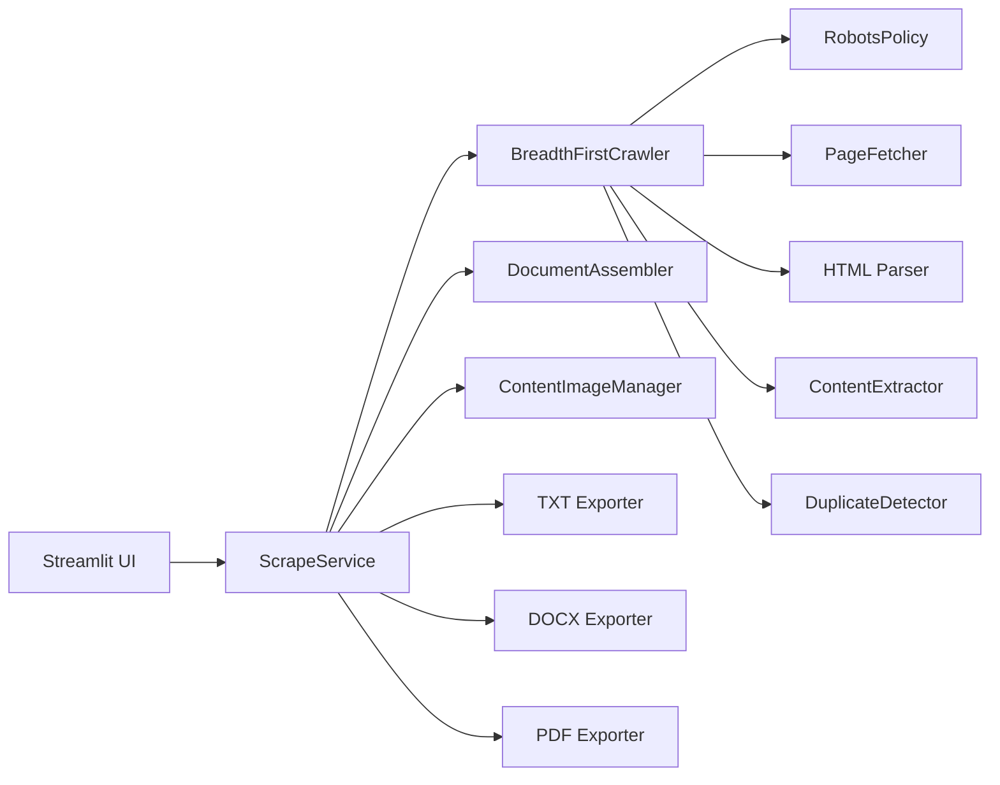

# Architecture Overview

Web Scraper Studio is designed as a layered scraping pipeline rather than a single large script.

## Flow

## Design choices

- The crawler is breadth-first so exported content follows a natural site-navigation order.
- `robots.txt` is respected by default and can only be changed in the developer config, not from the standard UI.
- The fetcher is conservative: retries, delay enforcement, redirect following, and response-size caps are all enabled.
- Readability extraction is primary, with `trafilatura` as fallback when cleaned content is too thin.
- Duplicate prevention combines URL normalization with normalized text similarity checks.
- Export generation is isolated from scraping so output formats can evolve without touching crawl logic.

## Important boundaries

- The app stays within the user-selected scope: same subdomain or same root domain.
- It ignores obvious non-content paths such as login, cart, account, admin, tag, and print-style pages.
- It does not attempt to bypass authentication, paywalls, captchas, or anti-bot controls.
- Browser rendering is optional and best-effort. It helps with JS-heavy pages when Playwright is installed, but it is not a bypass mechanism.

